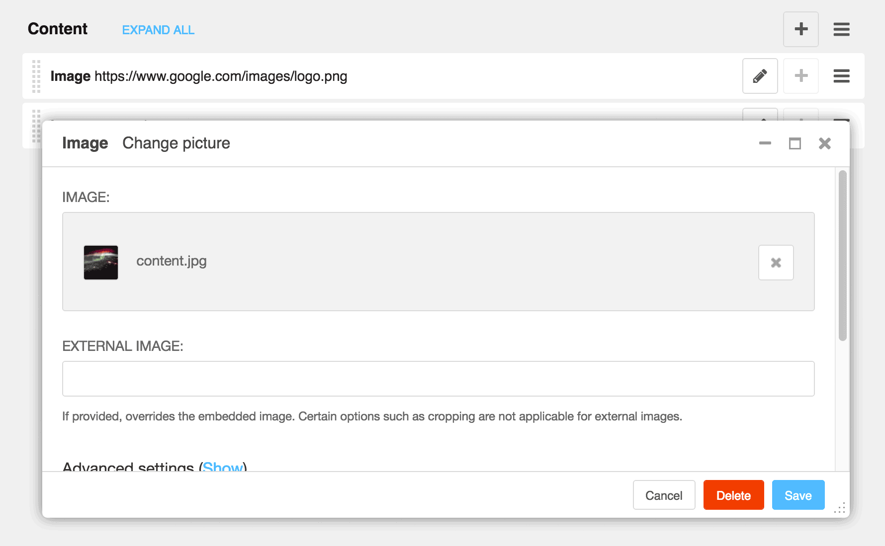

==================
django CMS Picture
==================

|pypi| |build| |coverage|

**django CMS Picture** is a plugin for `django CMS <http://django-cms.org>`_
that allows you to add images on your site.

This addon is compatible with `Divio Cloud <http://divio.com>`_ and is also available on the
`django CMS Marketplace <https://marketplace.django-cms.org/en/addons/browse/djangocms-picture/>`_
for easy installation.

Contributing
============

This is a an open-source project. We'll be delighted to receive your
feedback in the form of issues and pull requests. Before submitting your
pull request, please review our `contribution guidelines
<http://docs.django-cms.org/en/latest/contributing/index.html>`_.

We're grateful to all contributors who have helped create and maintain this package.
Contributors are listed at the `contributors <https://github.com/divio/djangocms-picture/graphs/contributors>`_
section.

One of the easiest contributions you can make is helping to translate this addon on
`Transifex <https://www.transifex.com/projects/p/djangocms-picture/>`_.

Documentation
=============

See ``REQUIREMENTS`` in the `setup.py <https://github.com/divio/djangocms-picture/blob/master/setup.py>`_
file for additional dependencies:

|python| |django| |djangocms|

* Django Filer 1.3.0 or higher

Make sure `django Filer <http://django-filer.readthedocs.io/en/latest/installation.html>`_
is installed and configured appropriately.

Installation
------------

For a manual install:

* run ``pip install djangocms-picture``
* add ``djangocms_picture`` to your ``INSTALLED_APPS``
* run ``python manage.py migrate djangocms_picture``

Configuration
-------------

Note that the provided templates are very minimal by design. You are encouraged
to adapt and override them to your project's requirements.

This addon provides a ``default`` template for all instances. You can provide
additional template choices by adding a ``DJANGOCMS_PICTURE_TEMPLATES``
setting::

    DJANGOCMS_PICTURE_TEMPLATES = [
        ('background', _('Background image')),
    ]

You'll need to create the `background` folder inside ``templates/djangocms_picture/``
otherwise you will get a *template does not exist* error. You can do this by
copying the ``default`` folder inside that directory and renaming it to
``background``.

Another setting is ``DJANGOCMS_PICTURE_NESTING``, which allows you to render an image
as the background image of a container that also contains other content (text, icons
and so on).
::

    DJANGOCMS_PICTURE_NESTING = True

will enable this (the default is ``False``). When set to ``True``, you'll be able to place additional
plugins inside the picture plugin.

You can override alignment styles with ``DJANGOCMS_PICTURE_ALIGN``, for example::

    DJANGOCMS_PICTURE_ALIGN = [
        ('top', _('Top Aligned')),
    ]

This will generate a class prefixed with ``align-``. The example above
would produce a ``class="align-top"``. Adding a ``class`` key to the image
attributes automatically merges the alignment with the attribute class.

You can enable responsive images technique by setting``DJANGOCMS_PICTURE_RESPONSIVE_IMAGES`` to ``True``.
In this case uploaded images will create thumbnails of different sizes according
to ``DJANGOCMS_PICTURE_RESPONSIVE_IMAGES_VIEWPORT_BREAKPOINTS`` (which defaults to ``[576, 768, 992]``) and browser
will be responsible for choosing the best image to display (based upon the screen viewport).

You can use ``DJANGOCMS_PICTURE_RATIO`` to set the width/height ratio of images
if these values are not set explicitly on the image::

    DJANGOCMS_PICTURE_RATIO = 1.618

We use the `golden ratio <https://en.wikipedia.org/wiki/golden_ratio>`_,
approximately 1.618, as a default value for this.

When working out sizes for the image, the system will use the following values,
of preference:

* the width or height set in the *Thumbnail options*
* *Autoscale*
* the *Width* and *Height*

We recommend setting width or height values around a placeholder so
when the plugin uses *Autoscale* it can discover them::

    
        
    

Further configuration can be achieved through
`django Filer <https://django-filer.readthedocs.io/en/latest/settings.html>`_.

Running Tests
-------------

You can run tests by executing::

    virtualenv env
    source env/bin/activate
    pip install -r test_requirements/base.txt
    python setup.py test

.. |pypi| image:: https://badge.fury.io/py/djangocms-picture.svg
    :target: http://badge.fury.io/py/djangocms-picture
.. |build| image:: https://travis-ci.org/divio/djangocms-picture.svg?branch=master
    :target: https://travis-ci.org/divio/djangocms-picture
.. |coverage| image:: https://codecov.io/gh/divio/djangocms-picture/branch/master/graph/badge.svg
    :target: https://codecov.io/gh/divio/djangocms-picture

.. |python| image:: https://img.shields.io/badge/python-2.7%20%7C%203.4+-blue.svg
    :target: https://pypi.org/project/djangocms-picture/
.. |django| image:: https://img.shields.io/badge/django-1.11%20%7C%202.1%20%7C%202.2-blue.svg
    :target: https://www.djangoproject.com/
.. |djangocms| image:: https://img.shields.io/badge/django%20CMS-3.4%2B-blue.svg
    :target: https://www.django-cms.org/
