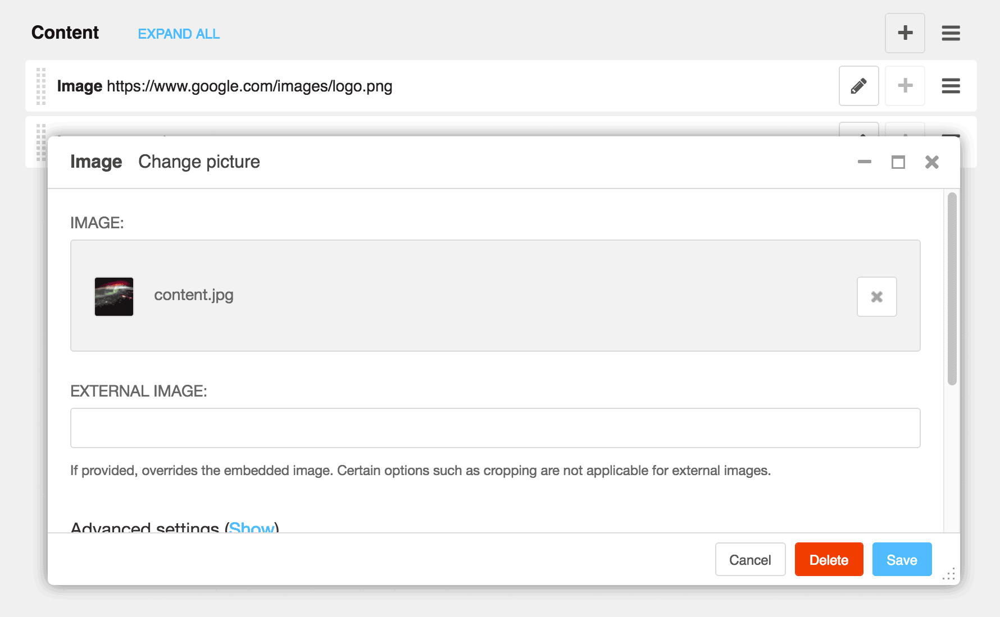

==================
django CMS Picture
==================

|pypi| |build| |coverage|

**django CMS Picture** is a plugin for `django CMS <http://django-cms.org>`_
that allows you to add images on your site.

.. note::

        This project is endorsed by the `django CMS Association <https://www.django-cms.org/en/about-us/>`_.
        That means that it is officially accepted by the dCA as being in line with our roadmap vision and development/plugin policy.
        Join us on `Slack <https://www.django-cms.org/slack/>`_.

*******************************************
Contribute to this project and win rewards
*******************************************

Because this is a an open-source project, we welcome everyone to
`get involved in the project <https://www.django-cms.org/en/contribute/>`_ and
`receive a reward <https://www.django-cms.org/en/bounty-program/>`_ for their contribution.
Become part of a fantastic community and help us make django CMS the best CMS in the world.

We'll be delighted to receive your
feedback in the form of issues and pull requests. Before submitting your
pull request, please review our `contribution guidelines
<http://docs.django-cms.org/en/latest/contributing/index.html>`_.

We're grateful to all contributors who have helped create and maintain this package.
Contributors are listed at the `contributors <https://github.com/django-cms/djangocms-picture/graphs/contributors>`_
section.

Documentation
=============

See ``dependencies`` in the `pyproject.toml <https://github.com/django-cms/djangocms-picture/blob/master/pyproject.toml>`_
file for additional dependencies:

|python| |django| |djangocms|

* Django Filer 1.7 or higher

Make sure `django-filer <http://django-filer.readthedocs.io/en/latest/installation.html>`_
is installed and configured appropriately.

Installation
------------

For a manual install:

* run ``pip install djangocms-picture``
* add ``djangocms_picture`` and ``djangocms_picture.contrib.filer`` to your
  ``INSTALLED_APPS``
* run ``python manage.py migrate djangocms_picture``

The explicit ``djangocms_picture.contrib.filer`` entry registers the
django-filer integration. For backwards compatibility, omitting it currently
leaves the configured filer backend available but raises a system-check
warning. In a future version, django-filer support will not be available unless
the contrib app is explicitly installed.

Configuration
-------------

Note that the provided templates are very minimal by design. You are encouraged
to adapt and override them to your project's requirements.

Optional djangocms-link integration
~~~~~~~~~~~~~~~~~~~~~~~~~~~~~~~~~~~

Install the ``link`` extra and add ``djangocms_link`` to ``INSTALLED_APPS`` to
use the djangocms-link 5+ destination picker for picture links::

    pip install "djangocms-picture[link]"

    INSTALLED_APPS = [
        # ...
        "djangocms_link",
        "djangocms_picture",
    ]

Run migrations after enabling the integration. Existing external and internal
page links are copied into the new link field. The legacy URL and page fields
remain in the database and continue to be used when djangocms-link 5 or newer
is not installed as a Django app. When the new field contains an HTTP(S) URL or
a django CMS page, the form also mirrors it into the corresponding legacy
column. Link types that the legacy fields cannot represent, such as files,
email addresses and anchors, are only stored in the new field.

Backend configuration and lifecycle
~~~~~~~~~~~~~~~~~~~~~~~~~~~~~~~~~~~

The filer and external-URL backends are enabled by default. A default backend
can be disabled explicitly with ``None``; at least one backend must remain::

    DJANGOCMS_PICTURE_BACKENDS = {
        "url": None,
    }

This example leaves only filer enabled, so the backend selector is hidden. A
custom backend is added by putting its configuration in the same dictionary.

Backend aliases are persistent data identifiers. Keep an alias stable for as
long as picture records use it, and migrate those records before permanently
removing or renaming the backend. An already persisted unknown alias renders as
an unavailable image rather than failing the complete page, allowing the
affected plugins to be edited and moved to an available backend.

Changing backends replaces the stored source while retaining supported
presentation settings. Rendition options unsupported by the active backend are
ignored at render time.

Backend-aware models and forms
~~~~~~~~~~~~~~~~~~~~~~~~~~~~~~

A normal Django model can reuse the same storage and all configured picker
widgets. It needs an alias, a textual generic relation and a JSON field. The
virtual descriptor combines them into one value::

    from django.contrib.contenttypes.fields import GenericForeignKey
    from django.contrib.contenttypes.models import ContentType
    from django.db import models

    from djangocms_picture.backends import PictureSourceDescriptor

    class Hero(models.Model):
        image_backend = models.CharField(max_length=32, default="filer")
        image_content_type = models.ForeignKey(
            ContentType, blank=True, null=True, on_delete=models.PROTECT,
        )
        image_object_id = models.CharField(max_length=255, blank=True, null=True)
        image_object = GenericForeignKey("image_content_type", "image_object_id")
        image_config = models.JSONField(blank=True, default=dict)
        image_source = PictureSourceDescriptor(
            backend_field="image_backend",
            content_type_field="image_content_type",
            object_id_field="image_object_id",
            config_field="image_config",
            object_field="image_object",
        )

The model form declares one logical field, initializes it from the descriptor
and applies its cleaned selection back to the descriptor::

    from django import forms

    from djangocms_picture.fields import BackendImageField, BackendSelection

    class HeroForm(forms.ModelForm):
        image_source = BackendImageField(required=False)

        class Meta:
            model = Hero
            fields = ("image_source",)

        def __init__(self, *args, request=None, **kwargs):
            super().__init__(*args, **kwargs)
            field = BackendImageField(request=request, required=False)
            self.fields["image_source"] = field
            if not self.is_bound:
                backend = field.backends_by_alias[self.instance.image_backend]
                self.initial["image_source"] = field.selection_from_instance(
                    self.instance, backend,
                )

        def save(self, commit=True):
            instance = super().save(commit=False)
            selection = self.cleaned_data["image_source"]
            if isinstance(selection, BackendSelection):
                self.fields["image_source"].apply_selection(instance, selection)
            if commit:
                instance.save()
            return instance

The cleaned value is a ``BackendSelection`` containing the configured backend
instance in ``backend`` and that backend field's cleaned ``value``.
Pass ``request=request`` when constructing the field if a remote DAM backend
needs user or tenant context. The widget includes the JavaScript controller and
all media declared by the backend picker widgets.

On ``PictureForm``, this single logical field writes the selected alias, the
optional generic Django object and the versioned ``picture_config`` JSON. Model
backends use a textual object ID, allowing filer integer keys and finder UUIDs
to share the same fields. URL and DAM backends leave the generic object empty.
The model exposes those backing columns as one virtual ``image_source`` value,
a ``StoredPictureSource`` containing the alias, serialized reference and
optional resolved object. Application and backend code should use that value
instead of updating the three storage columns independently.

``BackendSelection.serialize()`` returns a JSON-compatible dictionary, and
``BackendSelection.deserialize()`` restores the configured backend and its
cleaned value. The public envelope contains ``"version": 1``; unversioned data
is accepted as legacy version 1 and unknown versions fail explicitly. Django
model values use django-entangled's foreign-key convention:
``{"model": "app_label.model_name", "pk": primary_key}``.

Subwidgets have stable names based on backend aliases, for example
``image_source_backend``, ``image_source_filer``, and ``image_source_url``.
Only the selected
backend's field is validated. Capability metadata and supported configuration
fields are exposed to the controller so the active picker and related form
options stay in sync.

The complete `standalone backend-aware model and form example
<examples/standalone_backend_form.py>`_ also includes a database constraint,
backend validation, clearing an optional value and backend-neutral rendering.

Experimental django-finder backend
~~~~~~~~~~~~~~~~~~~~~~~~~~~~~~~~~~

The finder backend currently follows the latest commit on django-filer's
upstream ``finder`` branch. Install it with the image integrations::

    pip install "django-finder[image,svg] @ git+https://github.com/django-cms/django-filer.git@finder"

Add finder and the djangocms-picture contrib app to ``INSTALLED_APPS``::

    INSTALLED_APPS = [
        # ...
        "finder",
        "finder.contrib.image.pil",
        "finder.contrib.image.svg",
        "djangocms_picture",
        "djangocms_picture.contrib.finder",
    ]

Register finder and select the ambit used by its picker::

    DJANGOCMS_PICTURE_BACKENDS = {
        "finder": {
            "BACKEND": "djangocms_picture.contrib.finder.backend.FinderPictureBackend",
            "OPTIONS": {
                "ambit": "public",
                "allowed_ambits": ["public"],
            },
        },
    }
    DJANGOCMS_PICTURE_DEFAULT_BACKEND = "finder"

The finder picker API must also be included in the project URL configuration::

    from django.urls import include, path

    urlpatterns = [
        # ...
        path("finder/", include("finder.browser.urls")),
    ]

Run all migrations after enabling the contrib app. The backend currently
supports original images and focal cropping. Resize without cropping, upscale,
responsive sources, and programmatic backend uploads remain disabled until
finder provides stable public APIs for those operations.

To migrate plugin references after running django-finder's ``filer_to_finder``
command, use the dry-runnable, batched and reversible workflow documented in
`docs/migrating-filer-to-finder.rst <docs/migrating-filer-to-finder.rst>`_.

Experimental Frontify backend
~~~~~~~~~~~~~~~~~~~~~~~~~~~~~

The Frontify proof-of-concept is implemented directly by djangocms-picture and
does not require the older ``django-frontify`` package. Add the contrib app::

    INSTALLED_APPS = [
        # ...
        "djangocms_picture",
        "djangocms_picture.contrib.frontify",
    ]

Configure the public Finder client information and allow-list every host from
which stored image URLs may be rendered::

    DJANGOCMS_PICTURE_BACKENDS = {
        "frontify": {
            "BACKEND": "djangocms_picture.contrib.frontify.backend.FrontifyPictureBackend",
            "OPTIONS": {
                "account": "brand-library",
                "domain": "example.frontify.com",
                "client_id": "frontify-public-client-id",
                "allowed_hosts": [
                    "cdn.frontify.com",
                    "assets.frontify.com",
                ],
            },
        },
    }

Then run migrations. The picker requests permanent download URLs and persists
only a normalized, render-safe snapshot: asset ID, dimensions, label, alt text,
revision, focal point, and HTTPS processing/original URLs. Normal page renders
do not contact Frontify. Access tokens, OAuth secrets, arbitrary picker
metadata, query strings, and signed URL credentials are not stored.

The MIT-licensed Frontify Finder 2.0.1 SDK is bundled in this package, so the
admin does not load executable code from a CDN. A project may select another
reviewed, self-hosted build with the ``finder_script_url`` backend option.

For provider refreshes, configure a callable or import path as ``refresher``.
It receives ``(reference, request=None)`` and returns a fresh Finder payload.
Returning ``None`` marks the stored reference revoked when refreshed::

    "OPTIONS": {
        # ...picker and host options above...
        "refresher": "myproject.frontify.refresh_asset",
    }

Refresh snapshots outside the render path with::

    python manage.py refresh_frontify_assets --dry-run
    python manage.py refresh_frontify_assets --batch-size 100

An authenticated application webhook can call ``backend.revoke(asset_id)``.
If an account cannot issue permanent URLs, set ``allow_expiring_urls=True``;
the expiry is stored, signed query parameters are preserved, and expired assets
stop rendering until refresh. ``expiry_leeway_seconds`` can prevent emitting a
URL that is about to expire. Credentials and access tokens remain deployment
configuration and are never stored in picture references.

Unsplash backend
~~~~~~~~~~~~~~~~

The Unsplash backend provides an editor-side search picker and hotlinks the
image URLs returned by the Unsplash API. Add its contrib app::

    INSTALLED_APPS = [
        # ...
        "djangocms_picture",
        "djangocms_picture.contrib.unsplash",
    ]

Configure your application's public Unsplash access key and a stable name used
for attribution links::

    import os

    DJANGOCMS_PICTURE_BACKENDS = {
        "unsplash": {
            "BACKEND": "djangocms_picture.contrib.unsplash.backend.UnsplashPictureBackend",
            "OPTIONS": {
                "access_key": os.environ["UNSPLASH_ACCESS_KEY"],
                "application_name": "my-django-cms-site",
                "content_filter": "high",
                "per_page": 20,
            },
        },
    }

The picture plugin registers its staff-only, admin-styled picker with the
django CMS admin automatically. No project URL entry is needed. Standalone
forms outside the django CMS plugin admin can set the backend's ``picker_url``
option.

Run migrations. The popup lets editors filter searches by orientation,
colour, relevance/latest ordering and result page. ``orientation``, ``color``
and ``order_by`` backend options set their initial values; ``collections`` can
restrict searches to configured collection IDs. The site-controlled
``content_filter`` remains fixed for all editor searches.

The staff-only popup authenticates directly with Unsplash public
authentication; never configure or expose the Unsplash secret key. A site's
Content Security Policy must permit connections to
``https://api.unsplash.com`` and images from ``https://images.unsplash.com``.

Clicking a search result moves it into a preview. Editors can drag a filer-style
focus circle over the source image, choose an automatic or directional crop,
and set an optional output format and quality. ``Save selection`` stores these
defaults and triggers the photo's ``download_location`` event. Picture-level
width, height, upscale and responsive settings still control the requested
rendition dimensions. Stored renditions preserve Unsplash's ``ixid``
view-tracking parameter. Photographer and provider metadata remains available
as ``instance.image_attribution`` for projects that want to render it. Consult the
`Unsplash API guidelines <https://help.unsplash.com/en/articles/2511245-unsplash-api-guidelines>`_
before deploying the integration.

Backend implementers should read
`docs/backend-authoring.rst <docs/backend-authoring.rst>`_. A concrete proposal
for the missing finder resize contract is in
`docs/finder-rendition-api-proposal.rst <docs/finder-rendition-api-proposal.rst>`_.

Upgrading custom picture templates to 5.0
~~~~~~~~~~~~~~~~~~~~~~~~~~~~~~~~~~~~~~~~~

Version 5.0 introduces backend-neutral image assets. Existing custom templates
for the picture plugin must be reviewed and may require adjustment. In
particular, ``instance.picture`` contains the generic Django object for local
model-backed sources such as filer and finder, while ``instance.external_picture``
is a compatibility accessor for the URL backend.
Templates supporting every backend should use:

* ``instance.img_src`` for the rendered URL;
* ``instance.image_alt_text`` for the backend-provided alternative text;
* ``img_srcset_data`` for responsive renditions;
* ``instance.image_asset`` and ``instance.image_attribution`` for portable
  metadata; and
* ``picture_link`` or ``instance.get_link`` for the resolved destination.

Entries in ``img_srcset_data`` are now backend-neutral ``Rendition`` objects.
They retain ``url``, ``width`` and ``height``, but filer/easy-thumbnails-specific
attributes are no longer portable. Templates intended only for filer may
continue to access ``instance.picture``, although the backend-neutral helpers
are recommended.

At the Python object level, filer-only code can continue reading
``instance.picture`` and ``instance.picture_id`` and assigning either value.
The database field itself is now generic, however, so ORM and model-introspection
code must be adjusted: ``select_related("picture")``,
``filter(picture_id=...)`` and ``Picture._meta.get_field("picture")`` no longer
refer to a concrete filer foreign key. Use ``picture_content_type`` plus
``picture_object_id`` for low-level queries, or use ``image_source`` and the
backend-neutral rendering properties in application code.

This addon provides a ``default`` template for all instances. You can provide
additional template choices by adding a ``DJANGOCMS_PICTURE_TEMPLATES``
setting::

    DJANGOCMS_PICTURE_TEMPLATES = [
        ('background', _('Background image')),
    ]

You'll need to create the `background` folder inside ``templates/djangocms_picture/``
otherwise you will get a *template does not exist* error. You can do this by
copying the ``default`` folder inside that directory and renaming it to
``background``.

Another setting is ``DJANGOCMS_PICTURE_NESTING``, which allows you to render an image
as the background image of a container that also contains other content (text, icons
and so on). ::

    DJANGOCMS_PICTURE_NESTING = True

will enable this (the default is ``False``). When set to ``True``, you'll be able to place additional
plugins inside the picture plugin.

You can override alignment styles with ``DJANGOCMS_PICTURE_ALIGN``, for example::

    DJANGOCMS_PICTURE_ALIGN = [
        ('top', _('Top Aligned')),
    ]

This will generate a class prefixed with ``align-``. The example above
would produce a ``class="align-top"``. Adding a ``class`` key to the image
attributes automatically merges the alignment with the attribute class.

When using the ``DJANGOCMS_PICTURE_ALIGN`` setting, you have the flexibility to align images in various styles, such as left, right, or center, as well as to float images and vertically align them. You can customize these alignment options as follows::

    DJANGOCMS_PICTURE_ALIGN = [        
        ('left', _('Align left')),
        ('right', _('Align right')),
        ('center', _('Align center')),
        # Image float alignment options
        ("start", _("Float left")),            
        ("end", _("Float right")),
        # Vertical alignment options
        ('top', _('Align top')),
        ('middle', _('Align middle')),
        ('bottom', _('Align Bottom')),
        ('baseline', _('Align baseline')),           
    ]

This configuration will generate a CSS class prefixed with ``align-``. For example, when selecting the left align option, it will produce a class attribute like ``class="align-left"`` for the image. You can apply these classes to your image attributes, and they will automatically handle the alignment.

These alignment options are consistent with `Bootstrap's image alignment styles <https://getbootstrap.com/docs/5.3/content/images/#aligning-images>`_, however, **you have to provide your own CSS styles for the alignment options**, be it through Bootstrap or otherwise.

You can enable responsive images technique by setting ``DJANGOCMS_PICTURE_RESPONSIVE_IMAGES`` to ``True``.
In this case uploaded images will create thumbnails of different sizes according
to ``DJANGOCMS_PICTURE_RESPONSIVE_IMAGES_VIEWPORT_BREAKPOINTS`` (which defaults to ``[576, 768, 992]``) and browser
will be responsible for choosing the best image to display (based upon the screen viewport).

You can use ``DJANGOCMS_PICTURE_RATIO`` to set the width/height ratio of images
if these values are not set explicitly on the image::

    DJANGOCMS_PICTURE_RATIO = 1.618

We use the `golden ratio <https://en.wikipedia.org/wiki/golden_ratio>`_,
approximately 1.618, as a default value for this.

When working out sizes for the image, the system will use the following values,
of preference:

* the width or height set in the *Thumbnail options*
* *Autoscale*
* the *Width* and *Height*

We recommend setting width or height values around a placeholder so
when the plugin uses *Autoscale* it can discover them::

    
        
    

Further configuration can be achieved through the
`django Filer settings <https://django-filer.readthedocs.io/en/latest/settings.html>`_.

Running Tests
-------------

You can run tests by executing::

    python -m venv .venv
    source .venv/bin/activate
    python -m pip install -r tests/requirements/dj61_cms51.txt
    pytest

Run ``tox`` to test all supported Django and django CMS combinations.

.. |pypi| image:: https://badge.fury.io/py/djangocms-picture.svg
    :target: http://badge.fury.io/py/djangocms-picture
.. |build| image:: https://github.com/django-cms/djangocms-picture/actions/workflows/test.yml/badge.svg?branch=master
    :target: https://github.com/django-cms/djangocms-picture/actions/workflows/test.yml
.. |coverage| image:: https://codecov.io/gh/django-cms/djangocms-picture/branch/master/graph/badge.svg
    :target: https://codecov.io/gh/django-cms/djangocms-picture

.. |python| image:: https://img.shields.io/badge/python-3.10--3.14-blue.svg
    :target: https://pypi.org/project/djangocms-picture/
.. |django| image:: https://img.shields.io/badge/django-5.2%20%7C%206.0%20%7C%206.1-blue.svg
    :target: https://www.djangoproject.com/
.. |djangocms| image:: https://img.shields.io/badge/django%20CMS-5.0%20%7C%205.1-blue.svg
    :target: https://www.django-cms.org/

Updating from `cmsplugin-filer <https://github.com/django-cms/cmsplugin-filer>`_
--------------------------------------------------------------------------------

Historically, `cmsplugin-filer` was used to create file, folder, image, link, teaser & video plugins on your django CMS projects. Now `cmsplugin-filer` has been archived, you can still migrate your old instances without having to copy them manually to the new `djangocms-<file|picture|link|...>` plugins.

There's a third-party management command that supports your migration:

`migrate_cmsplugin_filer.py <https://gist.github.com/corentinbettiol/84a6ea7e4d047fc01861b0af15fd60f0>`_

This management command is only a starting point. It *has* worked out of the box for some people, but we encourage you to read the code, understand what it does, and test it on a development environment before running it on your production server.

The management command is only configured to transfer your `cmsplugin_link`, `cmsplugin_file`, `cmsplugin_folder` and `cmsplugin_image` plugins to modern `djangocms_*` plugins. If you need to transfer other `cmsplugin_*` plugins, you'll have to write your own code.

Alternatively you can use the `deprecate_cmsplugin_filer <https://github.com/ImaginaryLandscape/deprecate_cmsplugin_filer>`_ app, which only adds a small migration that transfer the old `cmsplugin-filer` plugins instances to the new `djangocms-<file|picture|link|...>` plugins.
